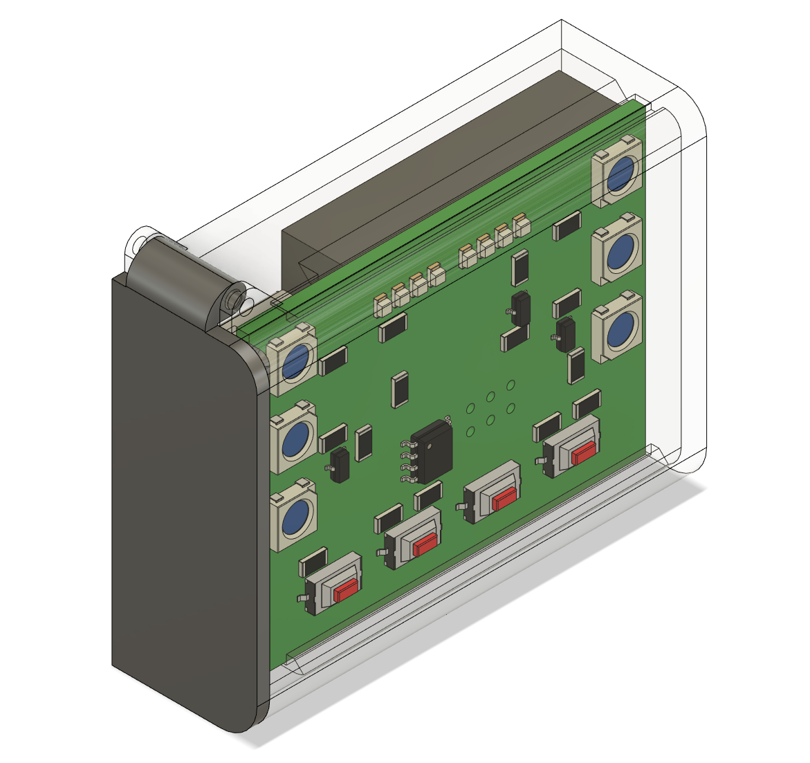

= tinylamp
Jonah Wille

The tinylamp is a small Headlamp using an ATtiny processor. It is Specifically designed for Scouts, it Features:

* Li-Ion rechargeable Battery
* Charging via Mini-Usb <<Why Mini-Usb?>>

A headlamp specifically designed for scouts

== Overview

== Design Decisions:

=== Why Mini-Usb?

Mini USB is a very durable connector, while USB-C is very susceptible to dust and dirt. Furthermore, Mini USB is easy to handsolder using hot air.

[CAUTION]
The charging port does not comply to USB standards, check schematic for further information.

== TO DOs
* [ ] Headband
* [ ] Inter Lamp Communication
